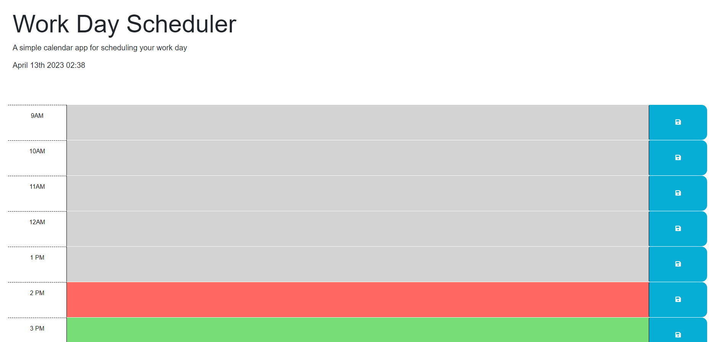

# Work Day Schedule

## Description

Welcome to Work Day Schedule, your go-to resource for organizing your daily schedule!

At Work Day Schedule, we understand that life can get busy and overwhelming at times, which is why we created this website to help you keep track of your daily tasks and appointments in one easy-to-use platform.

Our user-friendly interface allows you to add, edit, and delete tasks with just a few clicks, and our customizable options ensure that the website can be tailored to fit your specific needs and preferences.

Whether you're a student, professional, or just someone looking to stay organized, Work Day Schedule has everything you need to stay on top of your busy schedule.

Thank you for choosing Work Day Schedule as your daily schedule companion, and we hope you enjoy using our platform as much as we enjoyed creating it!

## Table of contents

- [Installation](#installation)
- [Usage](#usage)
- [Screenshot](#screenshot)
- [Contribution](#contribution)
- [Questions](#questions)
- [License](#license)

## Installation

Follow the link of the deployed application [Work Day Schedule](https://aleksandrbausher.github.io/Work-Day-Schedule/) ,

Otherwise clone GitHub repository [Work Day Schedule](https://github.com/AleksandrBausher/Work-Day-Schedule)

## Usage
Click here to access my [Work Day Schedule](https://aleksandrbausher.github.io/Work-Day-Schedule/), 
To know more about me and my projects

## Screenshot

## Contribution

Application was created by Aleksandr Bausher and if you want to contribute send me email.

## Questions

My Email:
[aleksandrbausher@gmail.com](mailto:aleksandrbausher@gmail.com)
My Github:
[AleksandrBausher](https://github.com/aleksandrbausher)

## License

